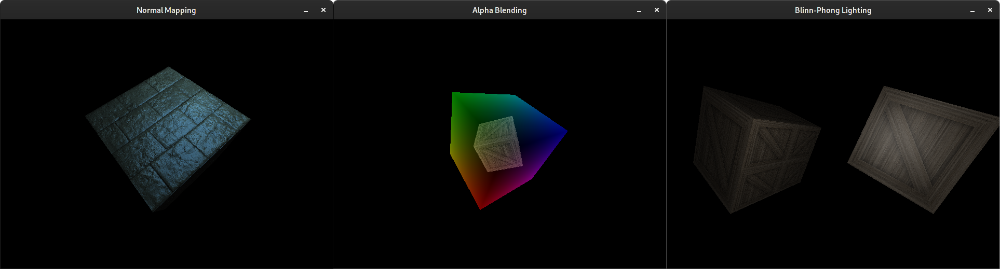

# Software Rasterizer

[](https://github.com/flubbe/swr/blob/main/LICENSE.txt)
[](https://github.com/flubbe/swr/actions)



## Introduction

This project is for learning how software rasterization (or rasterization in general) works. It mimics part of the
[OpenGL](https://www.khronos.org/opengl/) API, or at least took it as a strong inspiration of how things can work.
The color rendering is based on 32-bit floats.

The project directory layout consists of:

1.  the public header files `include/swr/swr.h`, `include/swr/shader.h`,
2.  the graphics library implementation part in `src/library/`,
3.  the demo applications in `src/demos/`,
4.  a support framework for quickly generating applications in `src/swr_app/`,
5.  some common files in `src/common/`,
6.  some textures in `textures/`.

For understanding the graphics pipeline code, you should probably start with the function `Present` in `src/library/pipeline.cpp`.
The primitive rasterization takes places in `src/library/rasterizer/point.cpp`, `src/library/rasterizer/line.cpp` and `src/library/rasterizer/triangle.cpp`.

Some configuration options can be set in `src/library/swr_internal.h`.

## Dependencies

The project uses [CMake](https://cmake.org/) for building and dependency fetching.

The dependencies are:

- [boost](https://www.boost.org/) and [Boost.Test](https://www.boost.org/),
- [SDL3](https://www.libsdl.org/),
- [Google's benchmark library](https://github.com/google/benchmark),
- [Compositional Numeric Library](https://github.com/johnmcfarlane/cnl),
- [cpu_features](https://github.com/google/cpu_features),
- [libmorton](https://github.com/Forceflow/libmorton),
- [stb](https://github.com/nothings/stb),
- [simdjson](https://github.com/simdjson/simdjson),
- [tinyobjloader](https://github.com/tinyobjloader/tinyobjloader),
- [ml](https://github.com/flubbe/ml),
- [concurrency_utils](https://github.com/flubbe/concurrency_utils).

## Building the Library and Demos

Configure and build the project:

```bash
cmake -B build
cmake --build build
```

Run the tests:

```bash
ctest --test-dir build
```

The executables are written to the `bin/` directory.

## Limitations

There are many, so in general expect things to not work if you use the library. It is meant for learning after all,
with no specific goal in mind.

- Many functionalities are only partly implemented or not implemented at all.
- Error propagation and handling is mostly missing and sometimes not very consistent. For example, some functions
  throw std::runtime_error, while others may just set an error flag.
- The library is not thread-safe.

## Licenses

The project itself is licensed according to the MIT License.

- The textures are licensed under the terms stated in the corresponding NOTICE files.
- The car model in `demos/cars/assets/cars/cop` is licensed under CC0 1.0.
