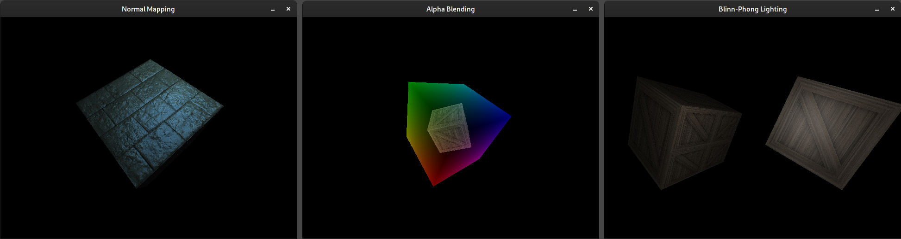

# Software Rasterizer

## Introduction

This project is for learning how software rasterization (or rasterization in general) works. It mimics part of the
[OpenGL](https://www.khronos.org/opengl/) API, or at least took it as a strong inspiration of how things can work.

The project directory layout consists of:
 1. the public header files `include/swr/swr.h`, `include/swr/shader.h`, `include/swr/stats.h`,
 2. the graphics library implementation part in `src/library/`,
 3. the demo applications in `src/demos/`,
 4. a support framework for quickly generating applications in `src/swr_app/`,
 5. some common files in `src/common/`,
 6. some textures in `textures/`.

For understanding the graphics pipeline code, you should probably start with the function `Present` in `src/library/pipeline.cpp`.
The primitive rasterization takes places in `src/library/rasterizer/point_st.cpp`, `src/library/rasterizer/line_st.cpp` and `src/library/rasterizer/triangle_st.cpp`.

Some configuration options can be set in `src/library/swr_internal.h`.

## Dependencies

The project uses [boost](https://www.boost.org/) and [SDL2](https://www.libsdl.org/). 

For the other dependencies:
- put the [Compositional Numeric Library](https://github.com/johnmcfarlane/cnl), release 1.1.2, in `deps/3rd-party/cnl`.
- put [cpu_features](https://github.com/google/cpu_features), release 0.6.0, into `deps/3rd-party/cpu_features`
- put [fmt](https://github.com/fmtlib/fmt), release 7.1.3, into `deps/3rd-party/fmt`
- if your use [Morton Codes](https://en.wikipedia.org/wiki/Z-order_curve) (enabled by default), put [libmorton](https://github.com/Forceflow/libmorton) into `deps/3rd-party/libmorton`
- clone [lodepng](https://github.com/lvandeve/lodepng) into `deps/3rd-party/lodepng`
- clone [ml](https://github.com/flubbe/ml) into `deps/ml`
- clone [concurrency_utils](https://github.com/flubbe/concurrency_utils) into `deps/concurrency_utils`

As a build system, the project uses [CMake](https://cmake.org/).

## Building the Library and Demos

Install the dependencies listed above. In the root directory, execute:
- `mkdir bin`
- `mkdir build`
- `cd build`
- `cmake .. -G Ninja` (or use any generator you like)
- `ninja`

Alternatively, you can use the included build scripts:
- Make the scripts executable: `chmod +x ./scripts/*`
- Set up the build directory structure and download the dependencies: `./scripts/pre-build.sh`
- Build the library and demos: `./scripts/build.sh`

If everything succeeded, you should find the demo files in the `bin`-directory.

Building was tested on Linux, GCC 11.1 (with C++-17 enabled), CMake 3.20.2 and [Ninja](https://ninja-build.org/) 1.10.2.

## Limitations

There are many, so in general expect things to not work if you use the library. It is meant for learning after all,
with no specific goal in mind.
- Many functionalities are only partly implemented or not implemented at all.
- Error propagation and handling is mostly missing and sometimes not very consistent. For example, some functions
throw std::runtime_error, while others may just set an error flag.
- The library is not thread-safe.

## Licenses

The project itself is licensed according to the MIT License.
- The textures are licensed under the terms stated in the corresponding NOTICE files.
